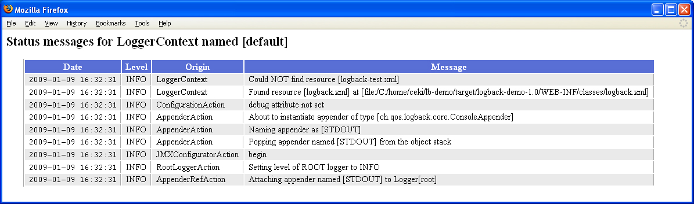

# 文档
[官网文档](https://logback.qos.ch/manual/introduction.html)

# 介绍

logback和log4j的作者是同一个人。logback是作为log4j的替代者出现的。
logback的依赖：

* logback-classic.jar
    *   -- slf4j-api.jar  
    *   -- logback-core.jar

## hello world
    public static void main(String[] args) {
        Logger logger = LoggerFactory.getLogger("chapters.introduction.HelloWorld2")    ;
        logger.debug("Hello world.");

        // print internal state
        LoggerContext lc = (LoggerContext) LoggerFactory.getILoggerFactory();
        StatusPrinter.print(lc);
      }

# 2结构
* logback三个模块：
    * logback-core    : 其它两个模块的基础
    * logback-classic : 扩展了core，原生继承 SLF4J API
    * logback-access  ：整合了Servlet，提供了HTTP访问日志的功能

* logback三个主要的类：
    *  Logger     :  在classic模块
    *  Appender   :  在core模块
    *  Layout.    :  在core模块

logback采取了**家谱式**目录。例如："com.foo" 的logger是 "com.foo.Bar"的logger的父母。
 "java" 是 "java.util" 的父母，是 "java.util.Vector". 的祖先。

logger的根-- “ROOT”

    Logger rootLogger = LoggerFactory.getLogger(org.slf4j.Logger.ROOT_LOGGER_NAME);

### 2.1日志有效等级 和 指定等级

X.Y如果没有指定日志等级，默认继承父母X的有效等级。
指定等级会*覆盖*继承的有效等级。
例子：
|Logger  name |   Assigned level	| Effective level  |
| -     |  -   |  -                 | 
|root	|DEBUG    |DEBUG
X	    |INFO    |INFO
X.Y	    |none    |INFO
X.Y.Z	|ERROR    |ERROR

日志等级从低到高：TRACE < DEBUG < INFO <  WARN < ERROR.

logger的方法日志等级>=logger有效等级才会打印日志，否则不能打印日志。
例如：logger的有效等级是INFO，logger.dubug不会打印日志，logger.warn或者logger.error才会打印日志。

### 2.2 logger名字相同，对象引用相同

Logger x = LoggerFactory.getLogger("wombat"); 
Logger y = LoggerFactory.getLogger("wombat");
x和y是同一个对象的引用。

用类的全限定名做logger的名字是通常的做法。也可以自由设置logger的名字。

### 2.3 Appenders and Layouts
appender:关注日志输出的位置
layout:负责日志的格式

logback允许一个日志请求输出多个目的地。一个输出目的地被称为appender。目的地可以是 console, files, remote socket servers, to MySQL, PostgreSQL, Oracle and other databases, JMS, and remote UNIX Syslog daemons.
一个looger可以有多个appender.
appenders 默认继承上层logger日志等级。例如：控制台appender被加入root logger，那么所有日志请求都会在控制台打印。

appender附加标记设置为false时不继承上层logger的appender，否则则相反。

`Appender Additivity` 输出源的可添加性.

<table class="bodyTable">
<tbody>
<tr>
<th>Logger Name</th>
<th>Attached Appenders</th>
<th>Additivity Flag</th>
<th>Output Targets</th>
<th>Comment</th>
</tr>
<tr>
<td>root</td>
<td>A1</td>
<td>not applicable</td>
<td>A1</td>

<td>Since the root logger stands at the top of the logger hierarchy, the additivity flag does not apply to it.
</td>
</tr>
<tr class="alt">
<td>x</td>
<td>A-x1, A-x2</td>
<td>true</td>
<td>A1, A-x1, A-x2</td>
<td>Appenders of "x" and of root.</td>
</tr>
<tr>
<td>x.y</td>
<td>none</td>
<td>true</td>
<td>A1, A-x1, A-x2</td>
<td>Appenders of "x" and of root.</td>
</tr>
<tr class="alt">
<td>x.y.z</td>
<td>A-xyz1</td>
<td>true</td>
<td>A1, A-x1, A-x2, A-xyz1</td>
<td>Appenders of "x.y.z", "x" and of root.</td>
</tr>
<tr>
<td>security</td>
<td>A-sec</td>
<td class="blue">
false
</td>
<td>A-sec</td>

<td>
No appender accumulation since the additivity flag is set to
<code>false</code>. Only appender A-sec will be used.
</td>
</tr>
<tr class="alt">
<td>security.access</td>
<td>none</td>
<td>true</td>
<td>A-sec</td>
<td>
Only appenders of "security" because the additivity flag in "security" is set to
<code>false</code>.
</td>
</tr>
</tbody>
</table>

### 2.4 参数化日志

#### 2.4.1 消息参数构造的性能损失例子
不管debug可不可用：一次评估损失 + 一次参数构造性能损失(直接参数构建，性能损失大)

    logger.debug("Entry number: " + i + " is " + String.valueOf(entry[i]));

### 2.4.2 先判断再打印
logger不可用时不会有消息参数构造的性能损失：
* debug可用： 两次评估性能损失+参数构造性能损失(appender中优化执行参数构造)
* debug不可用： 一次评估新能损失

logger的debug不可用时不会有消息参数构造的性能损失，debug可用时有消息参数构造的性能损失。
另外，dubug可用是，有两次isDebugEnabled的调用， 这个也会有微小的性能损失（<1%）。

    if(logger.isDebugEnabled()) { 
      logger.debug("Entry number: " + i + " is "    + String.valueOf(entry[i]));
    }

### 2.4.3
最佳方法：只有评估后日志可以打印，才会有消息参数构造的性能损失。 
debug可用：  一次评估损失 + 参数构造性能损失(appender中优化执行)
debug不可用：一次评估损失 

    Object entry = new SomeObject(); 
    logger.debug("The entry is {}.", entry);

# 2.4.4
debug不可用时，方式2是方式1性能的30倍以上。

    1. logger.debug("The new entry is "+entry+".");
    2. logger.debug("The new entry is {}.", entry);

### 2.5 性能
消息参数构造性能损失：比如日志参数装换成string，字符串连接等。

#### 2.5.1 比较
    x.debug("Entry number: " + i + "is " + entry[i]);
上面的代码导致消息参数构造的性能损失，比如，把两个整数i和entry[i]转成字符串，然后连接。无论debug日志等级可不可用。

    x.debug("Entry number: {} is {}", i, entry[i]);
这用slf4j的参数化打印方式会有大幅度的性能提升。因为参数构建不在dubug方法中执行，而是在appender中。而且，appender格式化消息是被高度优化了。

在频繁的循环中加入被关闭的logger也会拖慢系统的运行。

### 2.5.2 判断是否打印
logger在被创建时就知道了自己的有效日志等级，打印日志时不用查询祖先。
如果祖先的日志等级修改了， 所有的后代都会知道这个更改。(观察者模式)

打印到本机文件系统一行日志通常花费9到12ms, 打印到远程数据库通常花费几ms。

## 3 logback配置
  大约4%的代码是用来记录日志,所以需要专门的程序来管理日志.

### 3.1 配置logback
logback可以用程序或者用XML或者用groovy格式的配置文件.

#### 3.1.1 logback的初始化步骤:
    1. 首先再类路径下查找logback-test.xml
    2. 没有发现配置文件时,试着在类路径下诏logback.groovy
    3. 再没有发现配置文件时,检查类路径下的logback.xml
    4. 上面三步没有发现配置文件,使用[service-provider loading facility](https://docs.oracle.com/javase/6/docs/api/java/util/ServiceLoader.html)发现类路径下的文件`META-INF\services\ch.qos.logback.classic.spi.Configurator`,该文件应该实现Configurator接口.
    5. 上面4部都没有发现,  使用BasicConfigurator配置logback, 日志会直接输出到控制台.

#### 3.1.2 loback快速启动
logback解析配置文件大约需要100ms, 如果在应用启动时想节约这些时间,你可以使用上面步骤4中的spi配置.

#### 3.1.3 自动配置logback
没有配置文件时,logback使用 `BasicConfigurator` 来启动一个最小化配置, 使用ConsoleAppender作为根logger, 使用`%d{HH:mm:ss.SSS} [%thread] %-5level %logger{36} - %msg%n`配置`PatternLayoutEncoder`. 此外,根日志器设置为`DEBUG`水平.
代码通过`org.slf4j.LoggerFactory` 和 `org.slf4j.Logger`这两个slf4j抽象层的类来使用logback.使用slf4j的代码可以方便的像其它日志框架迁移.

### 3.1.4 使用logback.xml或者logback-test.xml自动配置logback
下面的xml文件等价于没有这个xml文件的自动配置.

    <configuration>

    <appender name="STDOUT" class="ch.qos.logback.core.ConsoleAppender">
        <!-- encoders are assigned the type ch.qos.logback.classic.encoder.PatternLayoutEncoder by default -->
        <encoder>
            <pattern>%d{HH:mm:ss.SSS} [%thread] %-5level %logger{36} - %msg%n</pattern>
        </encoder>
    </appender>

    <root level="debug">
        <appender-ref ref="STDOUT" />
    </root>
    </configuration>

### 3.1.5 warn或者error时自动打印状态信息

解析配置文件出错时会自动打印状态信息. 注意,如果用户注册了一个状态监听器就不会在解析出错时自动打印状态信息了.

下面中的代码是在程序中打印状态信息:

    public static void main(String[] args) {
    // assume SLF4J is bound to logback in the current environment
    LoggerContext lc = (LoggerContext) LoggerFactory.getILoggerFactory();
    // print logback's internal status
    StatusPrinter.print(lc);
    ...
    }

### 3.1.6 状态数据
配置logback的configurationd的属性`debug="true"`,使其在正常的情况下打印状态数据:

    <configuration debug="true"> 

    <appender name="STDOUT" class="ch.qos.logback.core.ConsoleAppender"> 
        <!-- encoders are  by default assigned the type
            ch.qos.logback.classic.encoder.PatternLayoutEncoder -->
        <encoder>
        <pattern>%d{HH:mm:ss.SSS} [%thread] %-5level %logger{36} - %msg%n</pattern>
        </encoder>
    </appender>

    <root level="debug">
        <appender-ref ref="STDOUT" />
    </root>
    </configuration>
或者

    <configuration>
        <statusListener class="ch.qos.logback.core.status.OnConsoleStatusListener" />  

         ... the rest of the configuration file  
    </configuration>

`<configuration debug="true"> `  <==> `OnConsoleStatusListener`

通过上面的方法开启输出状态数据对于处理logback的问题大有帮助,强烈建议开启.

### 3.1.7 使用系统属性指定默认配置文件的位置
属性:`logback.configurationFile`
值:URL,类路径下的资源,应用外的绝对路径
注意: 文件扩展名必须是`.xml`或者`.groovy`,其它扩展名将会沪铝

    java -Dlogback.configurationFile=/path/to/config.xml chapters.configuration.MyApp1

或者

    import ch.qos.logback.classic.util.ContextInitializer;

    public class ServerMain {
        public static void main(String args[]) throws IOException, InterruptedException {
        // 保证在logger实例化前设置系统属性.
        // must be set before the first call to  LoggerFactory.getLogger();
        // ContextInitializer.CONFIG_FILE_PROPERTY is set to "logback.configurationFile"
        System.setProperty(ContextInitializer.CONFIG_FILE_PROPERTY, /path/to/config.xml);
        ...
        }   
    }

### 3.1.8 配置文件改变时自动重载
配置

    <configuration scan="true"> 
    ... 
    </configuration> 

默认每分钟扫描一次.可以配置扫描周期.

    <configuration scan="true" scanPeriod="30 seconds" > 
    ...
    </configuration> 
注意: 没有指定时间单位时是毫秒,所以指定时间单位

开启`scan="true"`后,会启动一个单独的线程执行任务`ReconfigureOnChangeTask`来检查配置文件是否改变,同时也会检查`include`文件.

因为修改文件容易出错,新版logback会在修改出错后回退到先前正确的配置文件.

### 3.1.9 堆栈跟踪中打印包版本
配置:

<configuration packagingData="true">
  ...
</configuration>

或者

  LoggerContext lc = (LoggerContext) LoggerFactory.getILoggerFactory();
  lc.setPackagingDataEnabled(true);

  1.1.4后默认关闭包版本数据.  包版本数据很有用,但是计算这些数据开销很大,特别是频繁抛出异常的应用.

### 3.1.10 直接调用`JoranConfigurator`覆盖默认配置

    import org.slf4j.Logger;
    import org.slf4j.LoggerFactory;

    import ch.qos.logback.classic.LoggerContext;
    import ch.qos.logback.classic.joran.JoranConfigurator;
    import ch.qos.logback.core.joran.spi.JoranException;
    import ch.qos.logback.core.util.StatusPrinter;

    public class MyApp3 {
    final static Logger logger = LoggerFactory.getLogger(MyApp3.class);

    public static void main(String[] args) {
        // assume SLF4J is bound to logback in the current environment
        LoggerContext context = (LoggerContext) LoggerFactory.getILoggerFactory();
        
        try {
        JoranConfigurator configurator = new JoranConfigurator();
        configurator.setContext(context);
        // Call context.reset() to clear any previous configuration, e.g. default 
        // configuration. For multi-step configuration, omit calling context.reset().
        context.reset(); 
        configurator.doConfigure(args[0]);
        } catch (JoranException je) {
        // StatusPrinter will handle this
        }
        StatusPrinter.printInCaseOfErrorsOrWarnings(context);

        logger.info("Entering application.");

        Foo foo = new Foo();
        foo.doIt();
        logger.info("Exiting application.");
    }
    }

### 3.1.11 可视化状态信息

在WEB-INF/web.xml 配置
    <servlet>
        <servlet-name>ViewStatusMessages</servlet-name>
        <servlet-class>ch.qos.logback.classic.ViewStatusMessagesServlet</servlet-class>
    </servlet>

    <servlet-mapping>
        <servlet-name>ViewStatusMessages</servlet-name>
        <url-pattern>/lbClassicStatus</url-pattern>
    </servlet-mapping>

### 3.1.12 监听状态信息

方法1:
    LoggerContext lc = (LoggerContext) LoggerFactory.getILoggerFactory(); 
    StatusManager statusManager = lc.getStatusManager();
    OnConsoleStatusListener onConsoleListener = new OnConsoleStatusListener();
    statusManager.add(onConsoleListener);

方法2:

    <configuration>
    <statusListener class="ch.qos.logback.core.status.OnConsoleStatusListener" />  

    ... the rest of the configuration file  
    </configuration>

方法3:

    java -Dlogback.statusListenerClass=ch.qos.logback.core.status.OnConsoleStatusListener ...

* OnConsoleStatusListener 在控制台打印
* OnErrorConsoleStatusListener  在System.err打印
* NopStatusListener 丢弃状态信息

## 3.2 停止logback-classic
关闭loggers的所有的appender,有序停止激活的线程.

    import org.sflf4j.LoggerFactory;
    import ch.qos.logback.classic.LoggerContext;
    ...

    // assume SLF4J is bound to logback-classic in the current environment
    LoggerContext loggerContext = (LoggerContext) LoggerFactory.getILoggerFactory();
    loggerContext.stop();

web中停止logback-classic的方法是在`ServletContextListener` 的 `contextDestroyed` 

### 3.2.1 在shutdown hook中停止logback-classic

    <configuration debug="true">
    <!-- in the absence of the class attribute, assume 
    ch.qos.logback.core.hook.DefaultShutdownHook -->
    <shutdownHook/>
    .... 
    </configuration>

默认的关闭钩子`DefaultShutdownHook`会在延迟(默认0)后停止logback上下文,会为后台日志压缩任务留下至多30s的时间.

独立的jar应用中,在配置文件中加入`<shutdownHook/>`能确保后台的压缩日志任务在jvm退出前完成.

### 3.2.3 在web应用中停止logback

web应用中`webShutdownHook`会自动配置关闭钩子,**不用**再次配置.

在1.1.10后,`logback-classic`会*自动*在web服务器中安装实现了`ServletContainerInitializer`接口的` LogbackServletContainerInitializer`,初始化器依次实例化` LogbackServletContextListener`,这个监听器会在web停止或者重启时停止`logback-classic`.

也可以禁用`LogbackServletContextListener `的实例化,如下,在`web.xml`添加配置.

    <web-app>
        <context-param>
            <param-name>logbackDisableServletContainerInitializer</param-name>
            <param-value>true</param-value>
        </context-param>
        .... 
    </web-app>

`logbackDisableServletContainerInitializer `也可以在java系统属性中配置. 
优先级: `web.xml> java -D > 环境变量`

## 3.3 配置文件的语法
logback配置文件中有[0,+∞)个appender,[0,+∞)个logger,至多一个root元素.

### 3.3.1 标签元素大小写敏感
从0.9.17开始,标签名大小写敏感.  `<logger>, <Logger>, <LOGGER>`都是有效的元素. `<xyz>`必须匹配`</xyz>`,`</Xyz>`是错误的.

### 3.3.2 配置`<logger>`

必须理解[level inheritance](https://logback.qos.ch/manual/architecture.html#effectiveLevel)和 [the basic selection](rulehttps://logback.qos.ch/manual/architecture.html#effectiveLevel).

`<logger>` 必填属性:`name` ,可选属性:`level`, `additivity `.  `level`的大小写`不敏感`, INFO或者info都可以. 所有的level的值:TRACE, DEBUG, INFO, WARN, ERROR, ALL or OFF.

`<logger>`包含[0,+∞)个`<appender-ref>`,每个appender被加入logger. 与log4j不同,logback不能关闭或者移除先前的appenders.

### 3.3.3 配置`root logger(<logger>)`

`<root>`只有`level`,属性**没有**`name`属性

`<root>`也有元素`<appender-ref>`

### 3.3.4 例子

    <configuration>

    <appender name="STDOUT"
        class="ch.qos.logback.core.ConsoleAppender">
        <encoder>
        <pattern>
            %d{HH:mm:ss.SSS} [%thread] %-5level %logger{36} - %msg%n
        </pattern>
        </encoder>
    </appender>

    <logger name="chapters.configuration" level="INFO" />
    <logger name="chapters.configuration.Foo" level="DEBUG" />

    <root level="DEBUG">
        <appender-ref ref="STDOUT" />
    </root>

    </configuration>

<table class="bodyTable">
<tbody><tr>
<th>Logger name</th>
<th>Assigned Level</th>
<th>Effective Level</th>
</tr>
<tr>
<td>root</td>
<td><code>DEBUG</code></td>
<td><code>DEBUG</code></td>
</tr>
<tr class="alt">
<td>chapters.configuration</td>
<td><code>INFO</code></td>
<td><code>INFO</code></td>
</tr>
<tr>
<td>chapters.configuration.MyApp3</td>
<td><code>null</code></td>
<td><code>INFO</code></td>
</tr>
<tr class="alt">
<td>chapters.configuration.Foo</td>
<td><code>DEBUG</code></td>
<td><code>DEBUG</code></td>
</tr>
</tbody></table>