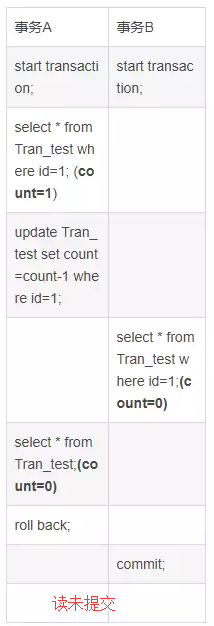
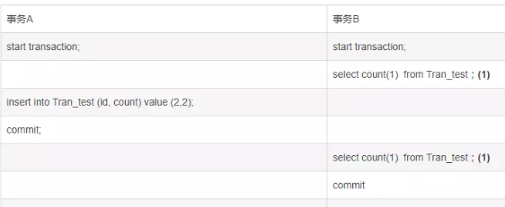

[微信公众号- MYSQL 事务隔离级别](https://mp.weixin.qq.com/s?__biz=MjM5NzMyMjAwMA==&mid=2651481499&idx=2&sn=b9c541991fe24f8ead4ba60ad819e6f9&chksm=bd2509e48a5280f299d0cbb18f379e4f76b94702c74160ac62c7ca333fdc5fb67cb06bcf0b47&scene=0#rd)

想象一个场景。抽奖，如果用户中奖了，一般有如下几个流程：

* 扣减奖品数量；
* 记录用户中奖信息；

试想如果扣减奖品数量了，结果记录用户中奖数据的时候失败了，那么数据就会出现不一致的问题。

这种场景，就可以使用事务。因为事务的一个特性，就是原子性：要么不做，要么全做。

上述问题解决了。再想一下这样的场景：

在抽奖前，先查询奖品剩余数量，如果剩余数量<1，则任务抽奖活动已经结束，不再进行抽奖。如果事务A扣减奖品数量但未提交，事务B查询剩余奖品数量，此时应该是多少呢？这就和事务的隔离级别有关系了。

在讨论隔离级别前，我们先做一些数据库的初始化操作：

建表：

    CREATE TABLE `Tran_test` (

    `id` bigint(20) NOT NULL,

    `userId` bigint(20) NOT NULL DEFAULT '0',

    `weChatId` varchar(50) NOT NULL DEFAULT '' COMMENT '微信id(openId、uninId)',

    `orderId` bigint(20) NOT NULL DEFAULT '0' COMMENT '商城订单id',

    `count` bigint(10) DEFAULT NULL,

    PRIMARY KEY (`id`)

    ) ENGINE=InnoDB DEFAULT CHARSET=utf8

初始化1个奖品：

insert into Tran_test (id,count) values(1,1)

## 未提交读

事务中的修改，即使没有提交，也会被其他事务读取。

下面通过mysql演示：

设置隔离级别为为提交读：

    SET GLOBAL TRANSACTION ISOLATION LEVEL READ UNCOMMITTED;

可以看到，事务B读取到了事务A未提交的数据，它任务抽奖活动已经结束。但如果此时事务A回滚，count仍然为1，则活动实际是未结束的，这就是脏读。因此，实际中，一般不会采用这种隔离级别。

## 提交读

提交读隔离级别可以解决上述脏读问题，其只能读到其他事务已经提交的数据。
更改数据库隔离级别：

    SET GLOBAL TRANSACTION ISOLATION LEVEL READ COMMITTED;

可以看到，在事务A提交前的改动，事务B是读取不到的。只有A事务提交后，B才能读取到事务A的改动。

我们看到，在事务B中，先后两次读取，count的值是不一样的，这就是不可重复读。而可重复读隔离级别可以解决这个问题。

事务B在事务A  commit 前后执行了两次select, 两次的结果可能不同.

## 可重复读
更改数据库隔离级别：

    SET GLOBAL TRANSACTION ISOLATION LEVEL REPEATABLE READ;

可以看到，不论事务A是否提交，事务B读到的count值都是不变的。这就是可重复读。

除了上面提到的脏读、不可重复读，还有一种情况是幻读：在事务中，前后两次查询，记录数量是不一样的。

比如事务B是事务A插入一条记录的前后执行查询，会发现相同的查询条件，查出来的记录数不一样。由于mysql的RR（可重复读）一并解决了幻读的问题，所以我们直接看上述场景，在mysql中的表现：

可见，在事务A提交前后，事务B查询的结果数量是一直的，并没有出现幻读的情况。

## 一点思考

下面默认都是讨论的msyql RR隔离级别的情况。

如果两个用户同时抽奖，而且同时中奖。两者都进入了中奖的事务。A事务扣减了奖品数量，B也执行了扣减数量。假设奖品数量是N，如果是可重复读，那么，如果两个事务并行进行，那么不论A有没有提交，B读到的数量都是N，执行后为N-1，而事务A也是N-1，这样不就有问题了吗？我们期望的是N-2。

当初这个问题让我很困惑。这反应了当时我对数据库锁和快照读、当前读两个知识点的欠缺。

## 快照读、当前读

将设事务A已经提交，由于是可重复读，那事务B读到的奖品数量一致是N，执行-1，数据变成N-1，而不是我们期望的N-2。

如果理解了快照读和当前读的概念，上面的困惑就不会存在了。

*在事务中，执行普通select查询之后，会创建快照，后面再执行相同的select语句时，查询的其实是前面生成的快照。* 这也就是为什么会有可重复读。

而如果执行

    select * from table where ? lock in share mode;

    select * from table where ? for update;

    insert into table values (…); 

    update table set ? where ?; 

    delete from table where ?;

会执行*当前读* ，获取最新数据。回到前面的问题，如果事务B执行N-1操作，会触发当前读，读取事务A提交后的数据，也就是N-1，在此基础上执行-1操作，最终N变成N-2。

并发更新

上面解决了事务A已经提交的额情况。但如果事务A更新奖品数量后但还未提交呢？此时事务B执行当前读拿到的也是N啊。了解数据库锁机制的话，就不会有这种困惑了。事务A提交前，会一直持有排他锁（具体是行锁还是表锁，要看查询条件有没有走索引），此时事务B更新是会阻塞的。也就是说，只有事务A提交，或回滚之后，事务B才能获得排它锁，从而进行更新奖品的操作。

关于数据库的锁，大家可以参考这篇文章：http://hedengcheng.com/?p=771