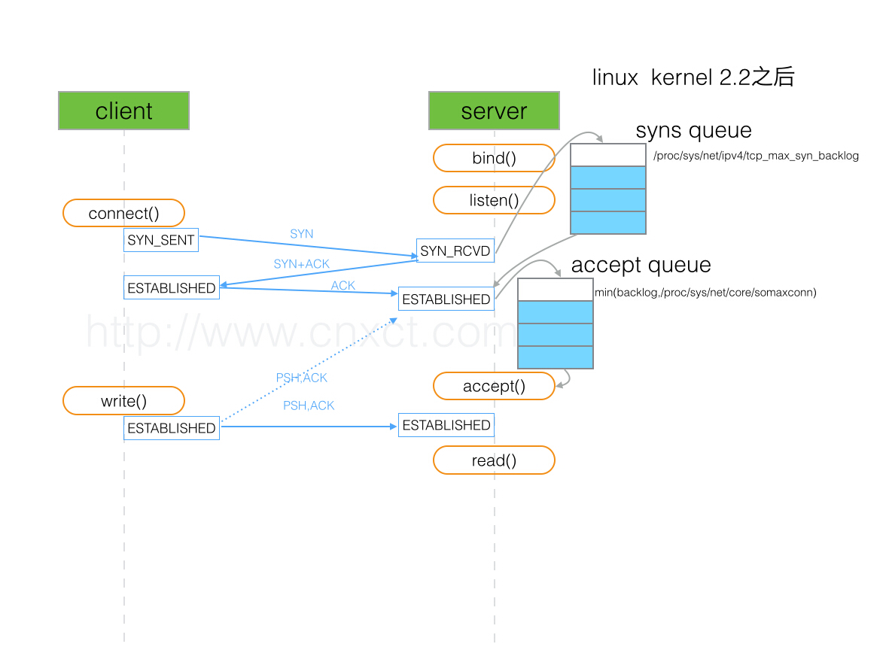

[TCP 三次握手原理，你真的理解吗？][https://mp.weixin.qq.com/s/yH3PzGEFopbpA-jw4MythQ]

socket 是TCP协议在java中的实现类。可以参考[Java Socket编程----通信是这样炼成的](https://www.cnblogs.com/rocomp/p/4790340.html)

## java ServerSocket 
backlog 表示tcp协议中的全连接队列的值，看下图

ServerSocket的构造函数中backlog默认50，写程序时要考虑应用的实际情况。 linux os 会按照min (backlog,proc/sys/net/core/somaxconn)取最小值，somaxconn 通常默认值是128。

	ServerSocket()
	Creates an unbound server socket.
	ServerSocket(int port)
	Creates a server socket, bound to the specified port.
	ServerSocket(int port, int backlog)
	Creates a server socket and binds it to the specified local port number, with the specified backlog.
	ServerSocket(int port, int backlog, InetAddress bindAddr)
	Create a server with the specified port, listen backlog, and local IP address to bind to.
	
参考：
*  https://blog.csdn.net/taolinke/article/details/6800979

## 半连接队列
半连接队列大小取决于：max(64,  /proc/sys/net/ipv4/tcp_max_syn_backlog)

## 查看某端口上的全连接数
	ss -lnt 
	Recv-Q Send-Q Local Address:Port Peer Address:Port
	0      50                 *:3306
上面看到的第二列Send-Q 值是50，表示第三列的listen端口上的全连接队列最大为50，第一列Recv-Q为全连接队列当前使用了多少。 

全连接队列的大小取决于：min(backlog, somaxconn) . backlog是在socket创建的时候传入的，somaxconn是一个os级别的系统参数。

## 查看系统的全连接队列数
	cat proc/sys/net/core/somaxconn 

## 如果TCP连接队列溢出，有哪些指标可以看呢？
	netstat -s | egrep "listen|LISTEN"
	667399 times the listen queue of a scoket overflowed
	66739 SYNs to LISTEN sockets ignored

比如上面看到的 667399 times ，表示全连接队列溢出的次数，隔几秒钟执行下，如果这个数字一直在增加的话肯定全连接队列偶尔满了。
	
	    ss -lnt 
		Recv-Q Send-Q Local Address:Port Peer Address:Port
		0      50                 *:3306
		
		
		
## 全连接队列满了会影响半连接队列吗？

## netstat -s看到的overflowed和ignored的数值有什么联系吗？

## 如果client走完了TCP握手的第三步，在client看来连接已经建立好了，但是server上的对应连接实际没有准备好，这个时候如果client发数据给server，server会怎么处理呢？（有同学说会reset，你觉得呢？）

